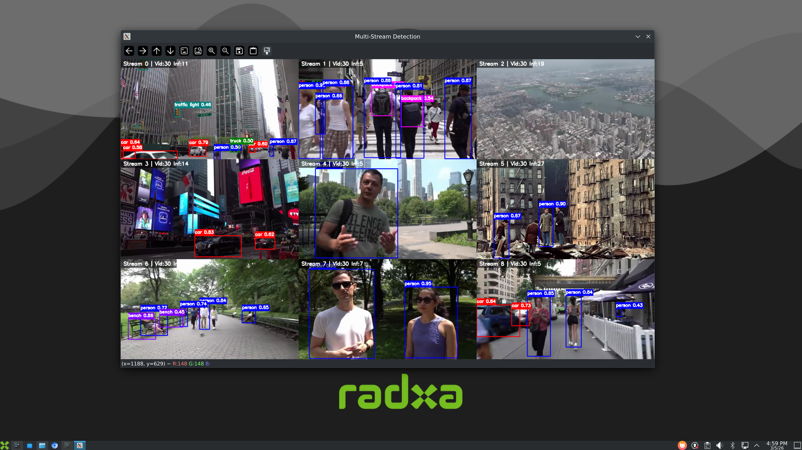

# RK3588 Multi-Stream YOLOv8 Detection

Multi-stream YOLOv8 object detection on RK3588 NPU using Python pipeline architecture.



## Features

- **Multi-stream processing**: Support 9+ video streams simultaneously
- **3-core NPU acceleration**: Fully utilize RK3588's 3 NPU cores
- **Pipeline architecture**: Decode → NPU Inference → Postprocess → Display
- **Real-time display**: Grid display with FPS statistics (Video FPS + Inference FPS)
- **Letterbox preprocessing**: Maintain aspect ratio for detection accuracy

## Requirements

- RK3588 development board
- RKNN toolkit-lite-2 installed
- OpenCV for Python
- Video files for testing

## Installation

```bash
# Install rknn-toolkit-lite2 (if not installed)
pip3 install rknn-toolkit-lite2
```

## Usage

### Basic Run (9 streams, 3 cores)

```bash
python main_rknn_pipeline.py
```

### No Display Mode (for testing)

```bash
python main_rknn_pipeline.py --no-display --max-frames 100
```

### Custom Parameters

```bash
python main_rknn_pipeline.py \
    --num-streams 6 \
    --num-cores 3 \
    --model yolov8n-i8-3588.rknn \
    --video-dir video \
    --conf-threshold 0.5 \
    --iou-threshold 0.45
```

## Command Line Options

| Parameter | Default | Description |
|-----------|---------|-------------|
| `--num-streams` | 9 | Number of video streams |
| `--num-cores` | 3 | NPU cores to use (1-3) |
| `--model` | yolov8n.rknn | Model file path |
| `--video-dir` | video | Video directory |
| `--conf-threshold` | 0.4 | Confidence threshold |
| `--iou-threshold` | 0.45 | NMS IoU threshold |
| `--no-display` | False | Disable display |
| `--max-frames` | None | Limit frame count |

## Performance

### 9 Streams, 3 Cores

| Stage | Time |
|-------|------|
| Decode | ~10 ms |
| Preprocess | ~15 ms |
| NPU Inference | ~32 ms |
| Postprocess | ~15 ms |
| Draw | ~7 ms |
| **Total** | **~78 ms** |

**FPS: ~12-13**

## Architecture

```
Main Thread: Result Collection → Draw → Display
                    ↑
            result_queue
                    ↑
NPU Workers (3): Inference → Postprocess
                    ↑
            task_queue
                    ↑
Decode Workers (N): Decode → Preprocess
                    ↑
            Video Files
```

## Project Structure

```
yolo_multi/
├── main_rknn_pipeline.py     # Main program
├── src_rknn/               # RKNN inference module
│   ├── rknn_inference.py   # Core inference engine
│   └── config.py
├── src/                    # Visualization module
│   ├── visualization.py
│   └── config.py
├── py_utils/               # Utilities
│   └── rknn_executor.py
├── video/                  # Test videos
├── dx_app/                 # Legacy examples
└── *.rknn                 # Model files
```

## Display Info

- **Vid**: Original video FPS (fixed value from video file)
- **Inf**: Real-time inference FPS (calculated from frame interval)

## Models

Place your RKNN models in the project root. Available models:
- `yolov8n-i8-3588.rknn` - YOLOv8 Nano
- `yolov8s-i8-3588.rknn` - YOLOv8 Small
- `yolov8m-i8-3588.rknn` - YOLOv8 Medium

## License

MIT License
